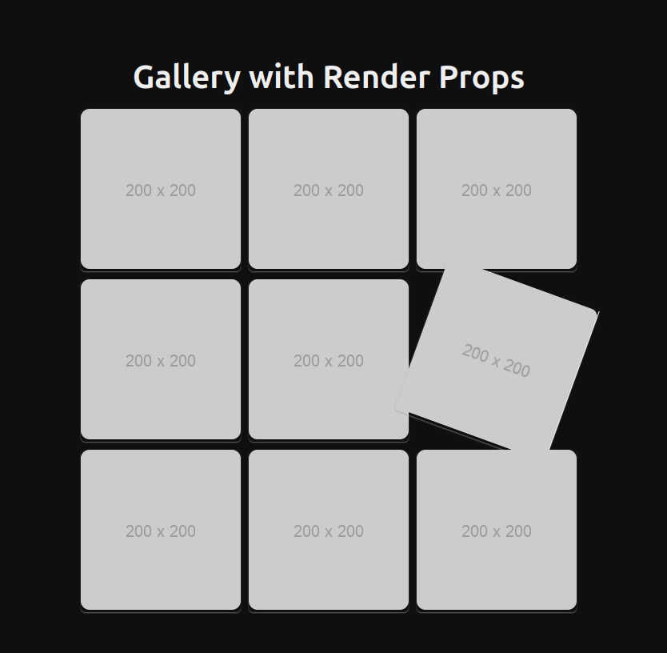

# Taller 02 - Talento Tech: Componente Render Props

Este proyecto es parte del **Taller 02 de Talento Tech** y su objetivo es crear un **componente de galería de imágenes** que utiliza el patrón de **Render Props** en React para manejar efectos visuales al interactuar con las imágenes (zoom y rotación).

## Descripción del Componente

El patrón **Render Props** permite que un componente comparta su lógica con otros componentes a través de una función que devuelve un elemento React. Este taller implementa una galería de imágenes donde se aplican efectos visuales a las imágenes, utilizando este patrón para mantener la lógica separada de la presentación.

### Funcionalidades del Componente:
- **Interactividad**: Permite aplicar efectos de zoom y rotación a las imágenes al pasar el mouse o al enfocar.
- **Reutilización**: Separa la lógica de presentación de los efectos visuales mediante el uso de Render Props.

### Componente: `ImageGallery`

El componente `ImageGallery` es el encargado de renderizar las imágenes utilizando Render Props. Recibe un arreglo de imágenes y una función que define cómo se debe renderizar cada imagen.

## Cómo ejecutar el proyecto

1. Clona el repositorio.
2. Instala las dependencias usando `npm install` o `yarn install`.
3. Ejecuta el proyecto con `npm start` o `yarn start`.

## Objetivos de Aprendizaje

1. **Entender el patrón Render Props en React** y cómo se utiliza para compartir lógica entre componentes.
2. **Aplicar efectos visuales** en componentes utilizando el estado local y eventos de interacción.
3. **Reutilización de componentes** mediante funciones que permiten personalizar su comportamiento de presentación.
4. **Mejorar la accesibilidad** y la usabilidad de las aplicaciones al considerar el manejo de eventos del teclado y mouse.

